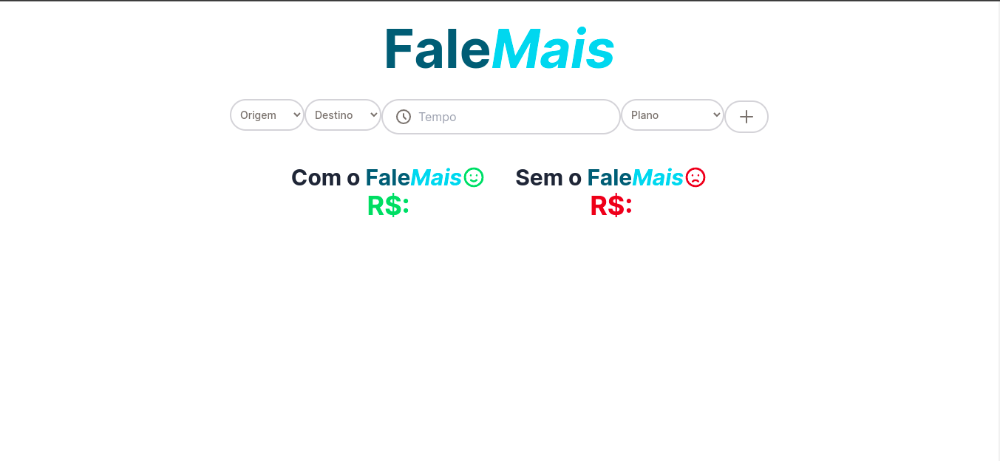
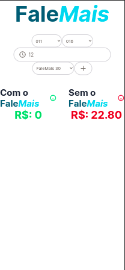

# FaleMais 📱

<p>
  Processo seletivo da LOLDESIGN.
</p>

<p>
  O projeto foi feito com Next.js, TypeScript, MongoDB e Tailwind. Caso queira executa-lo, será necessário que você alimente as seguintes variáveis em um arquivo .env, sendo a DB_URL a url que se conectará com o Mongo, DEV_URL, o link do seu localhost e PROD_URL link de produção :
</p>

```
DB_URL=
DEV_URL=
PROD_URL=
```


# A aplicação está on-line no link:


```
https://fale-mais-two.vercel.app/
```

## Para analisar o projeto em sua máquina, siga este passo a passo: 😁

<br>

## 🇧🇷

### Clone o repositório😎

```
git clone https://github.com/jovimoura/fale-mais
```

### Acesse o diretorio🤓

```
cd <nome-da-pasta>
```
### Instale as dependências🤠
```
npm install
```
### Inicie a aplicação🤩
```
npm run dev
```
### A aplicação, por padrão, fica na porta:🤗

```
http://localhost:3000/
```

## Imagem do projeto  💻



<br/>

## Responsive design 📱



## Tecnologias e Bibliotecas utilizadas🦉

<ul>
    <li>Next.JS</li>
    <li>MongoDB</li>
    <li>TypeScript</li>
    <li>Tailwind</li>
</ul>

##  🇧🇷 Feito por :

### João Victor dos Santos Moura
### E-mail: joaovictors.mouraa@gmail.com
### Linkedin: https://www.linkedin.com/in/jovimoura10/
